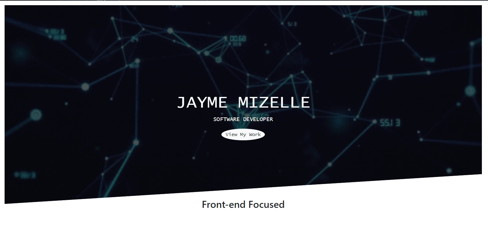

# Developer Portfolio

## Description
This is a responsive, dynamic Portfolio designed to showcase my projects and online presence as a developer. This web application is built with React.js and Bootstrap Components.

## Table of Contents
  - [Installation](#installation)
  - [Deployment](#deployment)
  - [Usage](#usage)
  - [Technologies](#technologies)
  - [License](#license)
  - [Next Steps](#next-steps)
  - [Questions](#questions)


## Installation
``` npm i ```

## Deployment
* Deployed Application URL: https://jayme-develops.netlify.app/

## Usage
Click on the deployed link above to browse my projects, view my resume, and more.


## Technologies
* JavaScript 
* Node Js  
* React.js 
* CSS3/Saas/Scss
* Bootstrap/React-Bootstrap

## License


  [MIT](https://opensource.org/licenses/MIT)
  

  

## Next Steps
* Update projects regularly

## Questions
For additional questions please contact:
* Jayme Mizelle
* Email: jlm_developer@protonmail.com
* https://github.com/jaymemizelle/
