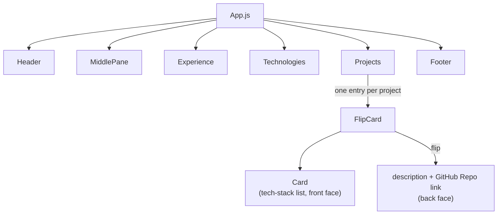

# Developer Portfolio

## Description

A responsive, dynamic portfolio site showcasing my projects and online presence as a developer. Built with React.js and Bootstrap.

## Table of Contents

- [Component Structure](#component-structure)
- [Deployment](#deployment)
- [Installation](#installation)
- [Usage](#usage)
- [Technologies](#technologies)
- [License](#license)
- [Next Steps](#next-steps)
- [About the Creator](#about-the-creator)

## Component Structure

Each project on the Projects section is a data-driven `FlipCard` rather than a hardcoded block — adding a project is a matter of adding one entry, not writing new markup:


```mermaid
flowchart TD
    APP["App.js"] --> HEADER["Header"]
    APP --> MIDDLE["MiddlePane"]
    APP --> EXP["Experience"]
    APP --> TECH["Technologies"]
    APP --> PROJ["Projects"]
    APP --> FOOT["Footer"]

    PROJ -->|"one entry per project"| FLIP["FlipCard"]
    FLIP --> CARD["Card\n(tech-stack list, front face)"]
    FLIP -->|"flip"| BACK["description + GitHub Repo link\n(back face)"]
```

```jsx
<FlipCard
  heading="LLM Evaluation Harness"
  child1="Python"
  child2="pytest | pytest-asyncio"
  child3="DeepEval"
  child4="Pydantic"
  child5="OpenAI Structured Outputs"
  description="Production LLM evaluation harness: a 3-judge LLM-as-a-judge scoring system (faithfulness, precision, recall) that gates every release with 320+ automated evaluations."
  gitRepURL="https://github.com/jaymehall/llm-evaluation-harness"
/>
```

## Deployment

[https://jaymehall-dev.netlify.app/](https://jaymehall-dev.netlify.app/)

## Installation

```
npm i
```

## Usage

Visit the deployed link above to browse my projects, view my resume, and more.

## Technologies

- JavaScript
- Node.js
- React.js
- CSS3 / Sass / SCSS
- Bootstrap / React-Bootstrap

## License

[MIT](https://opensource.org/licenses/MIT)


## Next Steps

- Update projects regularly

## About the Creator

Built to give recruiters and collaborators a fast, honest look at my work as a developer.

- LinkedIn: https://www.linkedin.com/in/jayme-hall/
- GitHub: https://github.com/jaymehall/
- Website: [https://jaymehall-dev.netlify.app/](https://jaymehall-dev.netlify.app/)
